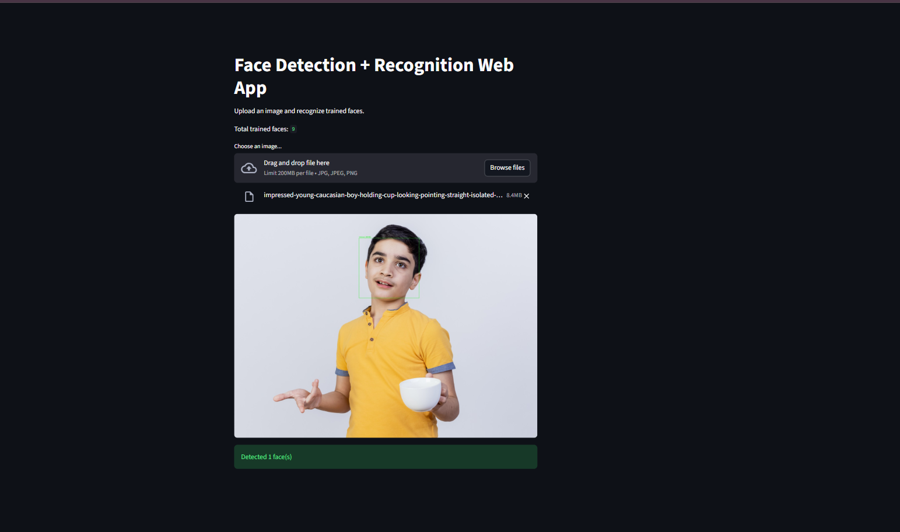
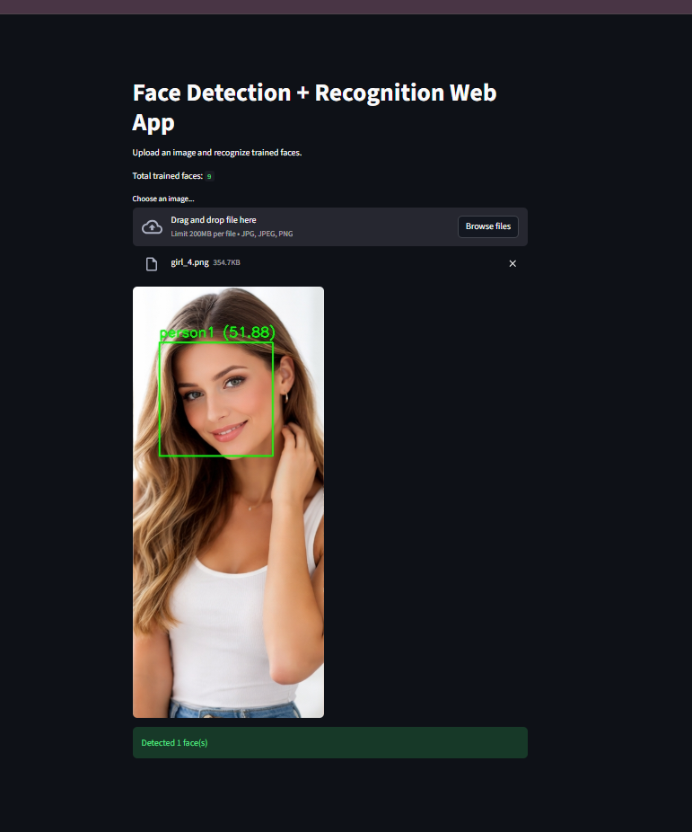

# 👁️ Face Detection + Recognition Web App

A cloud-deployed Face Detection and Face Recognition system built using **Streamlit + OpenCV (LBPH)**.

This application allows users to upload an image, detect faces, recognize trained individuals, and display recognition confidence — all directly in the browser.

---

## 🚀 Live Demo

👉 https://face-detection-web-nh7azu28f5g8qgzfgbmlep.streamlit.app/

---

## 📸 Application Preview

### 🔹 Face Detection


### 🔹 Face Recognition


---

## 🧠 Project Overview

This project demonstrates how classical computer vision techniques can be integrated into a production-ready cloud web application.

The system:

1. Accepts image uploads from users
2. Converts image to grayscale
3. Detects faces using Haar Cascade Classifier
4. Extracts detected face regions
5. Trains an LBPH Face Recognizer using dataset images
6. Predicts identity of detected faces
7. Displays name + confidence score
8. Shows total trained faces

---

## 🏗️ System Architecture

User → Streamlit UI →  
Image Processing (NumPy + OpenCV) →  
Haar Cascade Face Detection →  
LBPH Face Recognition →  
Result Display

---

## 🛠️ Tech Stack

- Python 3
- Streamlit (Web UI + Cloud Hosting)
- OpenCV (Face Detection + Recognition)
- NumPy (Image Processing)
- Haar Cascade Classifier
- LBPH (Local Binary Pattern Histogram)
- Git & GitHub
- Streamlit Cloud Deployment

---

## 🔍 Face Detection Method

This project uses the **Haar Cascade Classifier**:

- Pre-trained XML model from OpenCV
- Uses feature-based detection (edges & patterns)
- Sliding window scanning approach
- Fast and lightweight

---

## 🔎 Face Recognition Method

This project uses **LBPH (Local Binary Pattern Histogram)**:

- Extracts texture patterns from grayscale face
- Converts them into histogram features
- Compares histogram distance for matching
- Works efficiently for small datasets

### Confidence Score Meaning

- Lower value → Better match
- Higher value → Less confident match
- Threshold applied to avoid false recognition

---

## 📂 Dataset Structure

```
dataset/
│
├── person1/
│   ├── img1.jpg
│   ├── img2.jpg
│
├── person2/
│   ├── img1.jpg
│   ├── img2.jpg
```

Each folder represents one person label.

---

## 📦 Run Locally

```bash
git clone https://github.com/anshikaa3/face-detection-web.git
cd face-detection-web

python -m venv venv
venv\Scripts\activate

pip install -r requirements.txt
streamlit run app.py
```

The app will open in your browser automatically.

---

## 🌍 Deployment Details

- Hosted on Streamlit Cloud
- Uses opencv-contrib-python-headless
- Fully cloud compatible (no GUI dependency)
- Auto-rebuild on every GitHub push

---

## 📊 Features

- Detect multiple faces in one image
- Recognize trained individuals
- Display confidence score
- Show total number of trained faces
- Cloud accessible live demo
- Lightweight classical computer vision model

---

## 📈 Future Improvements

- Real-time webcam detection
- Deep learning model (FaceNet / DNN)
- Confidence threshold slider
- User registration system
- Docker container deployment

---

## 🎯 Key Learnings

- Face detection using Haar Cascade
- Face recognition using LBPH
- Image preprocessing techniques
- Dataset preparation for CV models
- Cloud deployment challenges
- Headless OpenCV usage
- Git version control best practices

---

## 👩‍💻 Author

**Anshika Srivastava**  
GitHub: https://github.com/anshikaa3
